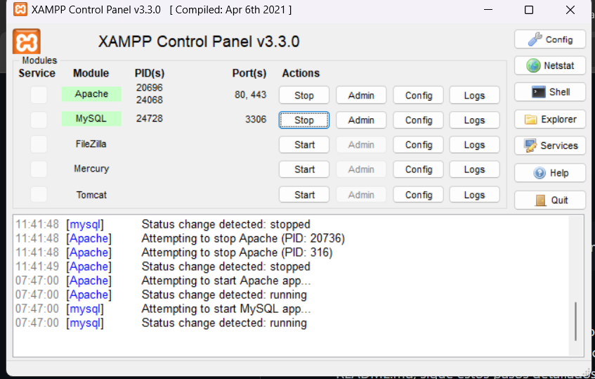
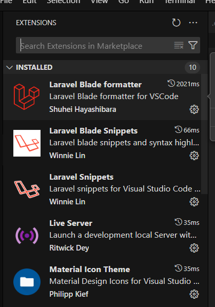
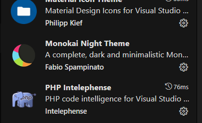
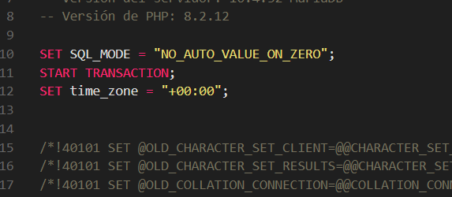
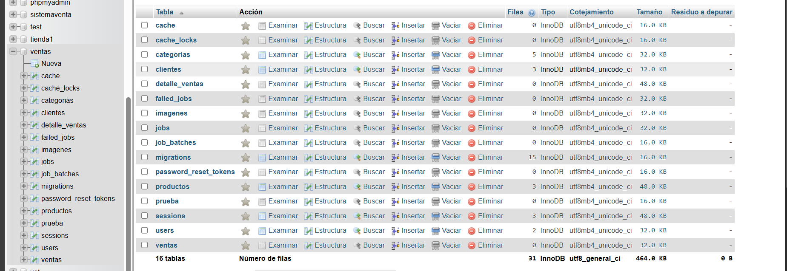
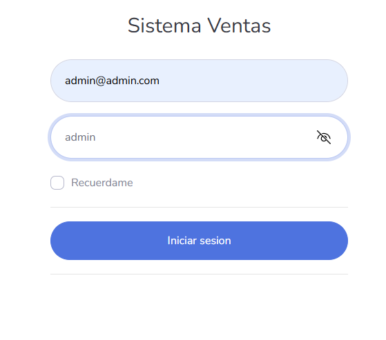
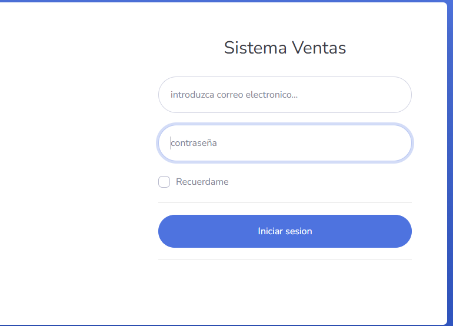
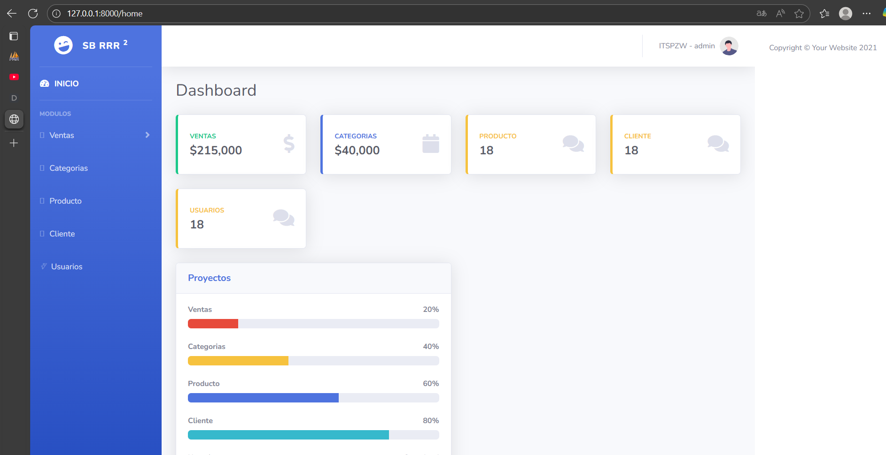
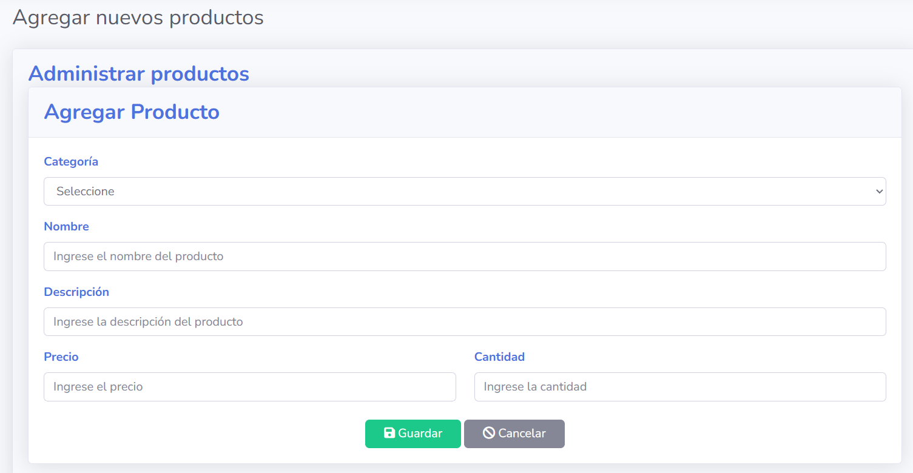
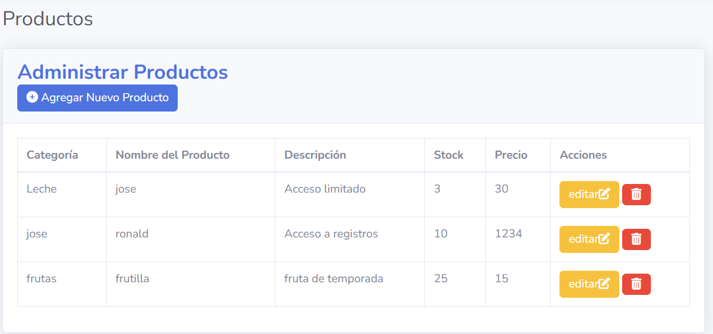

# PROYECTO LARAVEL DISEÑO Y PROGRAMACION WEB III

> Proyecto académico mostrando buenas prácticas con XAMPP, PHP, Visual Studio Code, Composer y conexión a MySQL, corriendo en Laravel.

---

## Tabla de Contenidos

- [¿Qué es este proyecto?](#qué-es-este-proyecto)
- [Instalación de herramientas](#instalación-de-herramientas)
  - [XAMPP (Apache + MySQL)](#xampp-apache--mysql)
  - [PHP](#php)
  - [Visual Studio Code y extensiones](#visual-studio-code-y-extensiones)
  - [Composer](#composer)
- [Configuración del entorno local (XAMPP)](#configuración-del-entorno-local-xampp)
- [Configurar la conexión a la base de datos](#configurar-la-conexión-a-la-base-de-datos)
- [Importar la base de datos MySQL](#importar-la-base-de-datos-mysql)
- [Migraciones en Laravel](#migraciones-en-laravel)
- [Cómo arrancar el servidor de desarrollo con PHP Artisan](#cómo-arrancar-el-servidor-de-desarrollo-con-php-artisan)
- [Carpetas y estructura del repositorio](#carpetas-y-estructura-del-repositorio)
- [Tecnologías y su propósito](#tecnologías-y-su-propósito)
- [Autor](#autor)
- [Licencia](#licencia)

---

## ¿Qué es este proyecto?  

**ejemplo3** es un proyecto de ejemplo desarrollado con el objetivo de mostrar cómo estructurar, documentar y poner en funcionamiento una aplicación web basada en Laravel y MySQL, siguiendo buenas prácticas en un entorno local con XAMPP.  
Sirve como guía académica para estudiantes o desarrolladores que quieran entender el flujo completo: desde la configuración del servidor y la base de datos, hasta la instalación de dependencias, manejo de migraciones, organización de carpetas y uso de VSCode con extensiones recomendadas. El ejemplo incluye funcionalidades comunes de los sistemas web, como gestión de usuarios, ventas, productos, clientes y categorías.

---

## Instalación de herramientas

### XAMPP (Apache + MySQL)

- Descarga e instala [XAMPP](https://www.apachefriends.org/es/index.html).
- Al instalar, accedes al panel de control donde arrancas **Apache** y **MySQL**.
- El servidor MySQL es el sistema de base de datos usado.

<!-- Imagen descriptiva: Panel de control de XAMPP, donde se inicia Apache y MySQL -->


---

### PHP

- Ya está incluido en XAMPP.
- Para verificar tu versión:
  ```sh
  php -v
  ```
- Recomiendo usar PHP **8.2+**.
- Si tienes problemas, instala PHP aparte desde [php.net](https://www.php.net/downloads).

---

### Visual Studio Code y extensiones

- Descarga [VSCode](https://code.visualstudio.com/).
- Instala extensiones recomendadas para facilitar tu desarrollo.

**Extensiones recomendadas:**
- Laravel Blade Formatter
- Laravel Blade Snippets
- Laravel Snippets
- Live Server
- Material Icon Theme
- Monokai Night Theme
- PHP Intelephense

<!-- Imagen descriptiva: Extensiones recomendadas en VSCode para desarrollo Laravel/PHP -->



---

### Composer

- Descarga desde [getcomposer.org](https://getcomposer.org/download/).
- Instala y verifica con:
  ```sh
  composer -V
  ```
- Para instalar dependencias del proyecto, dentro de la carpeta del proyecto ejecuta:
  ```sh
  composer install
  ```

---

## Configuración del entorno local (XAMPP)

1. Ejecuta **XAMPP Control Panel**.
2. Haz clic en **Start** para los servicios de **Apache** y **MySQL**.
3. Verifica que ambos estén en verde.

---

## Configurar la conexión a la base de datos

Tu archivo `.env` debe tener la siguiente configuración para que Laravel se conecte a MySQL de XAMPP:

```env
DB_CONNECTION=mysql
DB_HOST=127.0.0.1
DB_PORT=3306
DB_DATABASE=ventas
DB_USERNAME=root
DB_PASSWORD=
```

- **DB_HOST**: localhost, es tu propia máquina.
- **DB_PORT**: puerto 3306 es el estándar de MySQL.
- **DB_USERNAME**: por defecto en XAMPP es root y sin contraseña.

---

## Importar la base de datos MySQL

Puedes importar usando phpMyAdmin (`http://localhost/phpmyadmin`):

1. Crea una base de datos llamada **ventas**.
2. Selecciónala y usa la pestaña “Importar”.
3. Pega el script SQL de tablas y relaciones (incluido en este README).
4. Haz clic en *Continuar*.

<!-- Imagen descriptiva: Importación del archivo SQL para crear la base de datos 'ventas' -->


<!-- Imagen descriptiva: Visualización de la tabla ventas en phpMyAdmin -->


---
📦 Base de datos del proyecto (ventas.sql)

Para ejecutar correctamente el sistema en tu entorno local, necesitas importar la base de datos que contiene la estructura y los datos de ejemplo del proyecto.

🔽 Descargar archivo SQL

Puedes descargar el archivo directamente desde este repositorio:
👉 [Descargar `ventas.sql`](https://raw.githubusercontent.com/Ronaldfer00/ejemplo3/main/ventas.sql)


Este archivo incluye todas las tablas, relaciones y algunos registros de ejemplo (usuarios, productos, clientes y categorías) necesarios para que el sistema funcione de inmediato.

---
## Migraciones en Laravel

En **Laravel**, las migraciones son archivos PHP que describen la estructura de tus tablas:

1. Crea nuevas migraciones:
    ```sh
    php artisan make:migration create_productos_table
    ```
2. Aplica todas las migraciones (crea tablas en la base):
    ```sh
    php artisan migrate
    ```

Las migraciones se encuentran en la carpeta `/database/migrations`.

---

## Cómo arrancar el servidor de desarrollo con PHP Artisan

Para iniciar el servidor de Laravel/Artisan y poder visualizar tu proyecto en el navegador ejecuta:

```sh
php artisan serve
```
- La consola indicará la dirección (por lo general [http://127.0.0.1:8000](http://127.0.0.1:8000)).
- Accede a esa URL en tu navegador para abrir la aplicación.

<!-- Imagen descriptiva: Pantalla de login en el sistema vía Laravel -->



<!-- Imagen descriptiva: Vista principal/dashboard del sistema -->


<!-- Imagen descriptiva: Formulario de creación de productos -->


<!-- Imagen descriptiva: Listado de productos almacenados -->


---

## Carpetas y estructura del repositorio

```
ejemplo3/
├── assets/images/
├── public/
├── resources/views/
├── resources/scss/
├── css/
├── js/
├── index.html / index.php
├── README.md
├── .env
├── database.sql
```

---

## Tecnologías y su propósito

Este proyecto utiliza las siguientes tecnologías (porcentajes aproximados del código del repositorio):

| Tecnología   | Porcentaje | ¿Para qué sirve?                                                         |
|--------------|------------|--------------------------------------------------------------------------|
| **HTML**     | 43.3%      | Estructura básica de las páginas web.                                   |
| **CSS**      | 26.2%      | Estilos visuales generales para el sitio.                               |
| **Blade**    | 16.7%      | Motor de plantillas de Laravel para crear vistas dinámicas en PHP.       |
| **PHP**      | 8.8%       | Lógica de servidor y procesamiento de formularios.                      |
| **SCSS**     | 3.2%       | Preprocesador de CSS para organizar y reutilizar estilos.               |
| **JavaScript**| 1.8%      | Funcionalidades interactivas y dinámicas en el navegador.               |

---

## Autor

**Ronaldfer00**  
GitHub: [Ronaldfer00](https://github.com/Ronaldfer00)

---

## Licencia

Uso educativo y libre.
